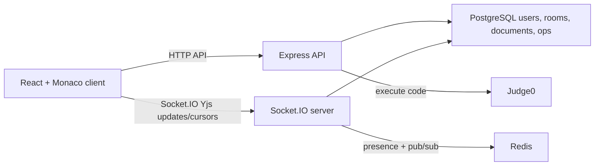

# CodeSync

CodeSync is a real-time collaborative code editor built as a local-first portfolio project. It combines Monaco Editor, Socket.IO, Yjs CRDT document sync, PostgreSQL persistence, Redis-backed presence/pub-sub, and Judge0-powered code execution to deliver a Google Docs-style coding experience.

## Features

- Real-time collaborative editing with Yjs CRDT-based conflict handling
- Monaco-powered editor with language templates
- VS Code-style editor modes for theme, word wrap, minimap, and font size
- Room creation and shareable room links
- Public or invite-only rooms with editor/viewer roles
- Read-only viewer mode enforced by the server
- Persisted operation history with revision replay
- Per-room shared notes docs for ideas, TODOs, and collaboration context
- JWT auth with access + refresh tokens
- Redis-backed presence and optional pub/sub fan-out
- Debounced PostgreSQL document persistence
- In-editor code execution for JavaScript, TypeScript, Python, Java, C++, C, Go, and Rust with stdin support

## Tech Stack

- Client: React, TypeScript, Vite, Monaco Editor, Socket.IO client
- Server: Node.js, Express, TypeScript, Socket.IO
- Data: PostgreSQL, Redis
- Execution: Judge0
- Infra artifacts: EC2 setup script, Nginx config, k6 load-test script

## Local Setup

### 1. Install dependencies

```bash
npm install
npm --prefix client install
npm --prefix server install
```

### 2. Start supporting services

- PostgreSQL
- Redis
- Judge0-compatible API endpoint

### 3. Configure environment variables

Copy the example files and fill in your local values:

```bash
cp server/.env.example server/.env
cp client/.env.example client/.env
```

### 4. Run database migrations

```bash
npm run migrate
```

### 5. Start the app

```bash
npm run dev
```

Client runs on `http://localhost:5173` and the server runs on `http://localhost:3001`.

## Environment Variables

### Server

Defined in [server/.env.example](/Users/harshitheturu/codeSync/server/.env.example):

- `PORT`: Express/Socket.IO port
- `CLIENT_URL`: allowed browser origin for CORS
- `DATABASE_URL`: PostgreSQL connection string
- `REDIS_URL`: Redis connection string
- `JWT_SECRET`: access token signing secret
- `JWT_REFRESH_SECRET`: refresh token signing secret
- `JUDGE0_BASE_URL`: Judge0 base URL
- `JUDGE0_API_KEY`: Judge0 auth token

### Client

Defined in [client/.env.example](/Users/harshitheturu/codeSync/client/.env.example):

- `VITE_WS_URL`: optional override for the Socket.IO server URL

For local development, API requests use Vite's `/api` proxy to `http://localhost:3001`.

## Scripts

- `npm run dev`: run client and server together
- `npm run build`: build client and server
- `npm run migrate`: run server DB migrations
- `npm run test:smoke`: run local integration smoke tests against a running server
- `node load-tests/concurrent-users.js`: k6 scenario source for concurrency testing

## Architecture Notes



### Collaboration model

CodeSync uses Yjs CRDT document updates for live editor collaboration. Each Monaco client binds local text changes into a shared `Y.Text`, sends Yjs binary updates over Socket.IO, and applies remote Yjs updates from the server. Yjs handles concurrent insert/delete merging so clients converge even when users edit the same area at the same time.

The server still keeps an authoritative in-memory Yjs document per room so it can enforce editor/viewer permissions, emit initial sync state on room join, persist snapshots, and derive simple operation log entries for version-history replay.

### Persistence model

Room state is kept as an in-memory Yjs document for fast collaboration and persisted to PostgreSQL with a 2-second debounce. This reduces write pressure but means the last couple seconds of edits can be lost on a crash.

Accepted Yjs updates are reflected into the live document snapshot. The server also derives simple insert/delete entries for `document_operations`, which powers the version-history replay UI. The live document snapshot remains the source of truth for loading the current editor state; the operation log is used for browsing historical revisions.

### Redis role

Redis is optional for local single-instance development. When available, it stores presence state and publishes operations across instances. If Redis is unavailable, the server falls back to in-process collaboration broadcasts.

For multi-instance deployments, Redis pub/sub lets one Socket.IO process fan out operations that were accepted by another process. Presence also uses Redis TTLs so stale cursors naturally expire.

### Room access model

Rooms can be public or invite-only. Public rooms grant the room's default role to any authenticated user with the link. Invite-only rooms require a valid invite token, which creates a `room_members` record. Owners can set the default invite role to editor or viewer. Viewer mode is enforced both in the React editor and in the Socket.IO operation handler, so a viewer cannot bypass the UI and emit edits directly.

### Shared notes

Each room has a separate notes document stored in `room_notes`. This keeps collaborative ideas, goals, TODOs, and explanations separate from the executable code document. Viewers can read notes, while editors and owners can save updates.

### Code execution

Execution requests are sent to Judge0 through the server so the browser never needs direct Judge0 credentials.

The execution panel supports stdin and surfaces run, result, timeout, and service-configuration errors.

## Known Tradeoffs

- Auth tokens are stored in `localStorage` for simplicity in this portfolio pass
- Yjs document state is snapshotted as plain text instead of storing native Yjs binary updates
- Version-history replay depends on operations logged after the feature was introduced; older edits only exist in the current snapshot
- Redis presence currently favors simplicity over advanced cleanup/indexing

## Verification

The current portfolio-ready baseline includes:

- clean root build via `npm run build`
- repeatable local smoke suite via `npm run test:smoke`
- local full-stack E2E with PostgreSQL, Redis, and Judge0
- local auth, room creation, room loading, and editor bootstrapping
- collaboration event wiring that avoids re-emitting remote edits
- visible loading and error states for the main user flows
- top-level React error boundary fallback
- invite-only and read-only room flows
- persisted operation history replay
- per-room shared notes docs
- language switching from owner room settings
- stdin-aware code execution

## What’s Next

- migrate auth from `localStorage` to `httpOnly` cookies
- wire up PM2, Nginx, HTTPS, and live AWS deployment
- run and tune the k6 load test against a deployed instance
- add a demo GIF to the README
