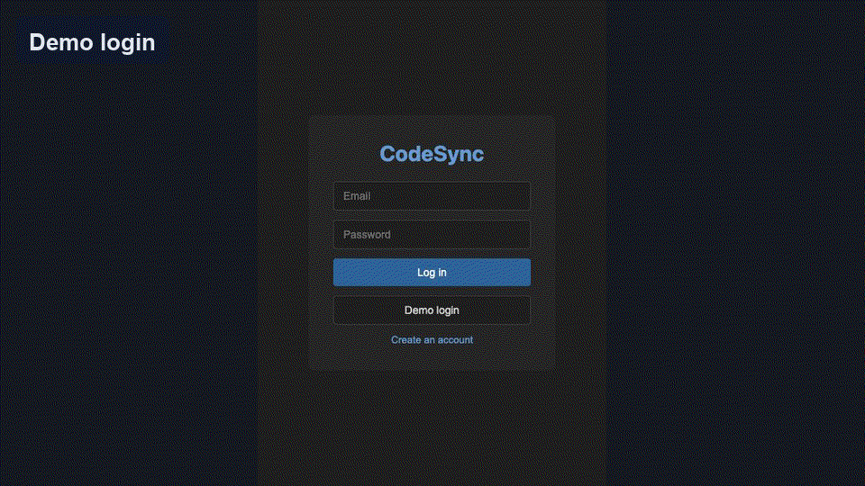
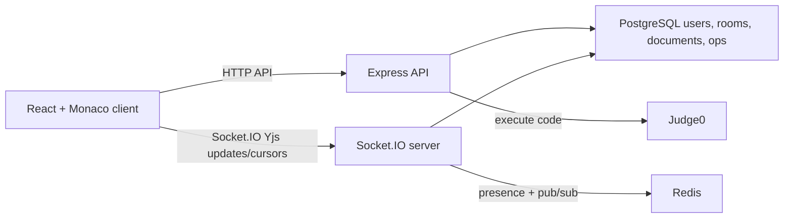

# CodeSync

CodeSync is a real-time collaborative code editor built as a deployed full-stack portfolio project. It combines Monaco Editor, Socket.IO, Yjs CRDT document sync, PostgreSQL persistence, Redis-backed presence/pub-sub, and Judge0-powered code execution to deliver a Google Docs-style coding experience.



## Project Pitch

CodeSync is a full-stack collaborative coding workspace where multiple users can join the same room, edit code together in real time, see each other's labeled typing cursors, share room notes, and execute code from the browser. The project is designed to show practical distributed-systems thinking in a product people already understand: Google Docs-style collaboration, but for code.

The most important engineering choice is the move from simple operation broadcasting to Yjs CRDT updates. That means concurrent edits can merge safely even when two users type in the same document at the same time. The server still controls access, persists snapshots, records replayable history entries, and fans out updates through Redis for multi-instance deployment.

## Technical Highlights

- Built a collaborative Monaco editor with Yjs CRDT document sync over Socket.IO.
- Added Google Docs-style cursor presence with per-user colors, selections, typing labels, and Redis-backed TTL cleanup.
- Implemented room permissions with public/invite-only access and server-enforced editor/viewer roles.
- Added Judge0-backed code execution for multiple languages with stdin and clear execution states.
- Persisted documents, room metadata, notes, and version-history operations in PostgreSQL.
- Hardened auth with `httpOnly` access/refresh cookies and automatic refresh on expired sessions.
- Deployed on AWS EC2 with Nginx, PM2, Redis, PostgreSQL, production build artifacts, smoke testing, and k6 WebSocket load testing.

## Interview Talking Points

- **CRDT vs OT:** The project uses Yjs CRDT updates so clients converge without needing a fragile custom transform pipeline for concurrent edits.
- **Server authority:** Clients can render read-only mode, but the Socket.IO server also rejects edit updates from viewers.
- **Persistence tradeoff:** Documents are kept in memory for low-latency collaboration and saved to PostgreSQL with a debounce to reduce write pressure.
- **Scaling path:** Redis handles presence state and cross-process Yjs update fan-out for PM2 or multi-instance deployments.
- **Security hardening:** Tokens are stored in `httpOnly` cookies instead of readable browser storage.

## Resume Bullets

- Built a real-time collaborative code editor using React, Monaco, Socket.IO, Yjs, Node.js, PostgreSQL, Redis, and Judge0.
- Implemented CRDT-based concurrent editing, Google Docs-style typing cursors, room permissions, version-history replay, and server-enforced read-only access.
- Added production hardening with `httpOnly` cookie auth, deployment runbook, Nginx config, PM2 process management, EC2 deployment, smoke tests, and k6 load-test coverage.

## Features

- Real-time collaborative editing with Yjs CRDT-based conflict handling
- Google Docs-style labeled cursors showing who is actively typing in every connected editor
- Monaco-powered editor with language templates
- VS Code-style editor modes for theme, word wrap, minimap, and font size
- Room creation and shareable room links
- Public or invite-only rooms with editor/viewer roles
- Read-only viewer mode enforced by the server
- Persisted operation history with revision replay
- Per-room shared notes docs for ideas, TODOs, and collaboration context
- JWT auth with `httpOnly` access + refresh cookies
- Redis-backed presence and optional pub/sub fan-out
- Debounced PostgreSQL document persistence
- In-editor code execution for JavaScript, TypeScript, Python, Java, C++, C, Go, and Rust with stdin support

## Current Deployment Status

- Production-style EC2 deployment is live on AWS with Nginx serving the React build and PM2 running the Node/Socket.IO server.
- Deployed smoke test passed against the EC2 instance:

```bash
CODESYNC_API_URL=http://54.196.134.253/api CODESYNC_WS_URL=http://54.196.134.253 npm run test:smoke
```

- k6 WebSocket load test passed against the EC2 instance with 50 virtual users for 60 seconds:
  - 100% checks passed
  - 300 WebSocket sessions completed
  - p95 WebSocket connect time around 121 ms

The current EC2 deployment uses plain HTTP on the public IP for portfolio testing. A custom domain and HTTPS certificate are the next production-hardening step.

## Tech Stack

- Client: React, TypeScript, Vite, Monaco Editor, Socket.IO client
- Server: Node.js, Express, TypeScript, Socket.IO
- Data: PostgreSQL, Redis
- Execution: Judge0
- Infra artifacts: EC2 setup script, Nginx config, k6 load-test script

## Local Setup

### 1. Install dependencies

```bash
npm install
npm --prefix client install
npm --prefix server install
```

### 2. Start supporting services

- PostgreSQL
- Redis
- Judge0-compatible API endpoint

### 3. Configure environment variables

Copy the example files and fill in your local values:

```bash
cp server/.env.example server/.env
cp client/.env.example client/.env
```

### 4. Run database migrations

```bash
npm run migrate
```

### 5. Start the app

```bash
npm run dev
```

Client runs on `http://localhost:5173` and the server runs on `http://localhost:3001`.

## Environment Variables

### Server

Defined in [server/.env.example](/Users/harshitheturu/codeSync/server/.env.example):

- `PORT`: Express/Socket.IO port
- `CLIENT_URL`: allowed browser origin for CORS
- `DATABASE_URL`: PostgreSQL connection string
- `REDIS_URL`: Redis connection string
- `JWT_SECRET`: access token signing secret
- `JWT_REFRESH_SECRET`: refresh token signing secret
- `COOKIE_SECURE`: set `false` only for plain-HTTP IP deployments; set `true` for HTTPS/domain deployments
- `JUDGE0_BASE_URL`: Judge0 base URL
- `JUDGE0_API_KEY`: Judge0 auth token

### Client

Defined in [client/.env.example](/Users/harshitheturu/codeSync/client/.env.example):

- `VITE_WS_URL`: optional override for the Socket.IO server URL; defaults to the current origin

For local development, API requests use Vite's `/api` proxy to `http://localhost:3001`.

## Scripts

- `npm run dev`: run client and server together
- `npm run build`: build client and server
- `npm run migrate`: run server DB migrations
- `npm run test:smoke`: run local integration smoke tests against a running server
- `BASE_URL=https://your-domain k6 run load-tests/concurrent-users.js`: run the WebSocket load test

## Deployment

Deployment notes live in [docs/deployment.md](/Users/harshitheturu/codeSync/docs/deployment.md). The EC2 deployment runs Nginx in front of the React static build and Node/Socket.IO API, with PM2 managing the server process and Redis available for presence/pub-sub.

## Architecture Notes



### Collaboration model

CodeSync uses Yjs CRDT document updates for live editor collaboration. Each Monaco client binds local text changes into a shared `Y.Text`, sends Yjs binary updates over Socket.IO, and applies remote Yjs updates from the server. Yjs handles concurrent insert/delete merging so clients converge even when users edit the same area at the same time.

Presence is separate from document content. Each editor sends cursor location, selection, and typing state over Socket.IO. Connected clients render a colored caret and label such as `editor1 typing` beside the active cursor, including on the user's own editor and on every other connected editor.

The server still keeps an authoritative in-memory Yjs document per room so it can enforce editor/viewer permissions, emit initial sync state on room join, persist snapshots, and derive simple operation log entries for version-history replay.

### Persistence model

Room state is kept as an in-memory Yjs document for fast collaboration and persisted to PostgreSQL with a 2-second debounce. This reduces write pressure but means the last couple seconds of edits can be lost on a crash.

Accepted Yjs updates are reflected into the live document snapshot. The server also derives simple insert/delete entries for `document_operations`, which powers the version-history replay UI. The live document snapshot remains the source of truth for loading the current editor state; the operation log is used for browsing historical revisions.

### Redis role

Redis is optional for local single-instance development. When available, it stores presence state and publishes Yjs updates across instances. If Redis is unavailable, the server falls back to in-process collaboration broadcasts.

For multi-instance deployments, Redis pub/sub lets one Socket.IO process fan out Yjs updates that were accepted by another process. Presence also uses Redis TTLs so stale cursors naturally expire.

### Room access model

Rooms can be public or invite-only. Public rooms grant the room's default role to any authenticated user with the link. Invite-only rooms require a valid invite token, which creates a `room_members` record. Owners can set the default invite role to editor or viewer. Viewer mode is enforced both in the React editor and in the Socket.IO Yjs update handler, so a viewer cannot bypass the UI and emit edits directly.

### Shared notes

Each room has a separate notes document stored in `room_notes`. This keeps collaborative ideas, goals, TODOs, and explanations separate from the executable code document. Viewers can read notes, while editors and owners can save updates.

### Code execution

Execution requests are sent to Judge0 through the server so the browser never needs direct Judge0 credentials.

The execution panel supports stdin and surfaces run, result, timeout, and service-configuration errors.

## Known Tradeoffs

- Auth uses `httpOnly` cookies; user id/name are kept in `localStorage` only for client-side routing and collaborator labels
- Yjs document state is snapshotted as plain text instead of storing native Yjs binary updates
- Version-history replay depends on operations logged after the feature was introduced; older edits only exist in the current snapshot
- Redis presence currently favors simplicity over advanced cleanup/indexing
- The current public EC2 URL is IP-based HTTP; production-grade public sharing should use a domain, HTTPS, and `COOKIE_SECURE=true`

## Verification

The current portfolio-ready baseline includes:

- clean root build via `npm run build`
- repeatable local smoke suite via `npm run test:smoke`
- deployed EC2/Nginx/PM2 environment
- deployed smoke suite passing against the EC2 instance
- k6 WebSocket load test passing at 50 virtual users for 60 seconds
- local full-stack E2E with PostgreSQL, Redis, and Judge0
- local auth, room creation, room loading, and editor bootstrapping
- collaboration event wiring that avoids re-emitting remote edits
- visual two-user typing presence verified locally, including labeled cursors in both connected editors
- visible loading and error states for the main user flows
- top-level React error boundary fallback
- invite-only and read-only room flows
- persisted operation history replay
- per-room shared notes docs
- language switching from owner room settings
- stdin-aware code execution

## What’s Next

- attach a custom domain and enable HTTPS with Certbot
- switch production cookies to `COOKIE_SECURE=true` after HTTPS is enabled
- record/update the demo GIF using the deployed app with two users editing at the same time
- optionally add CI to run build and smoke checks before every push
